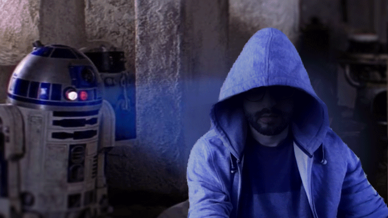
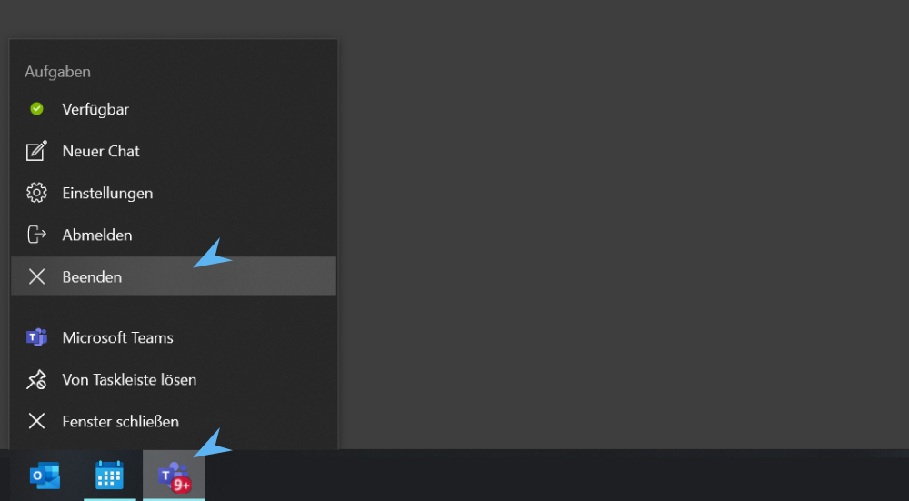
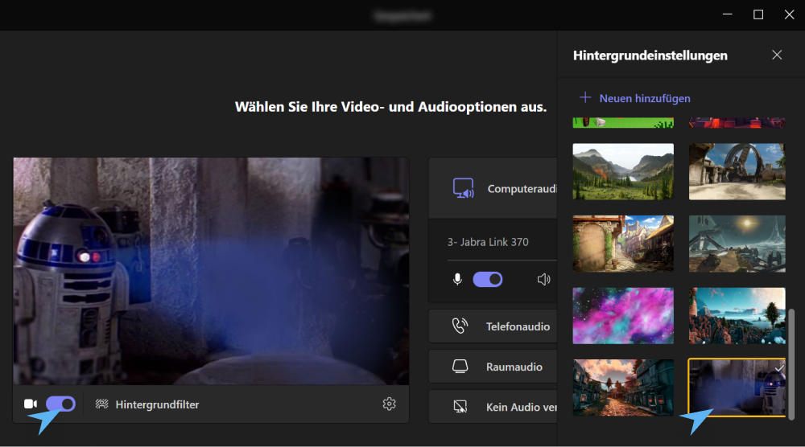
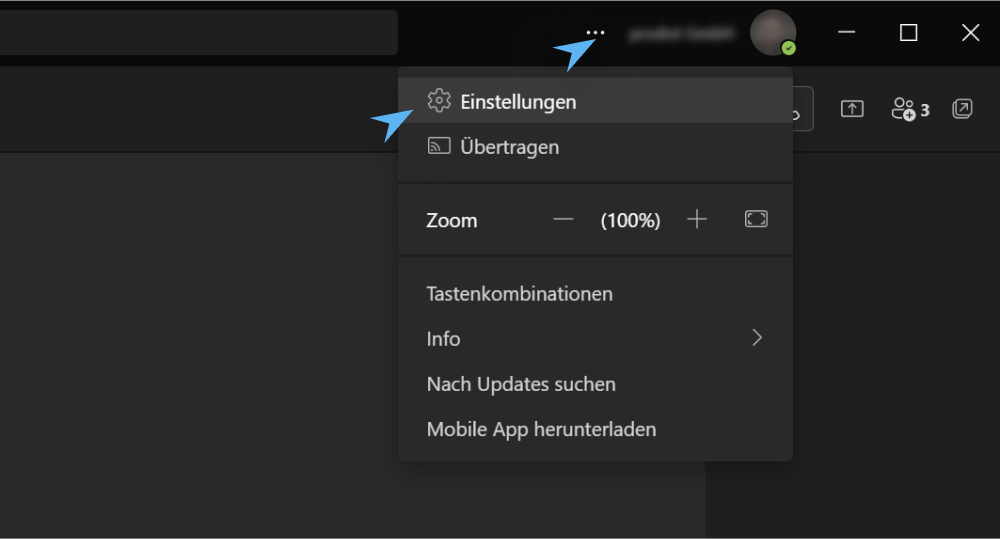
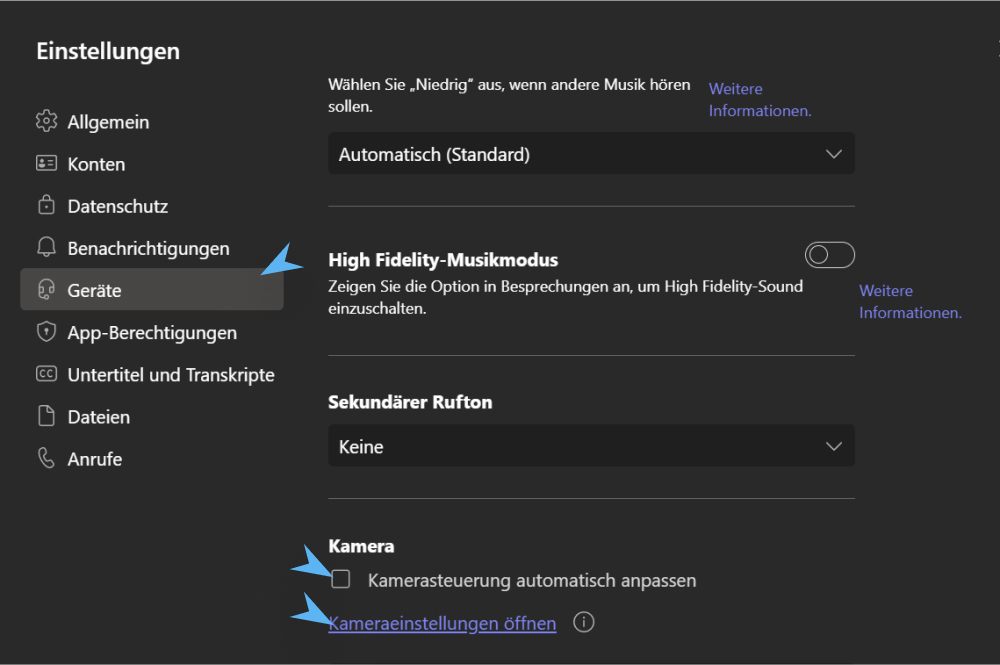
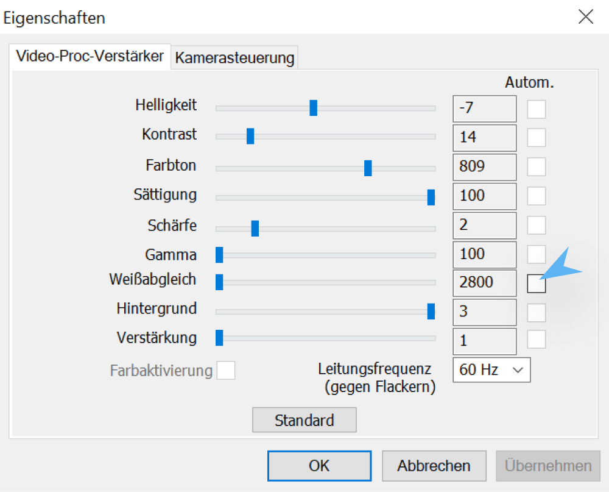

# Star Wars for Teams

## Inroduction

Microsoft Teams doesn't allow the upload of GIF images as virtual backgrounds by default. But by changing the file extension into .png and copying it (along with a duplicate named ..._thumb.png) manually into the folder, where teams stores custom backgrounds, it is possible anyhow. See https://return2.net/microsoft-teams-add-animated-background-image-gif/ for detailed instructions.
By combining this trick with some tweaks on the custom camera settings tinting the image blue, you can achieve a pretty neat hologram effect.

## Setup background image

1. Quit Teams by right clicking its icon in the taskbar
    
2. Press

        ⊞ Win + R  

    and enter the following path

        %AppData%\Microsoft\Teams\Backgrounds\Uploads

3. Copy [**teams-bg-r2.png** and **teams-bg-r2_thumb.png**](Uploads/) into this folder
4. Start Teams, join or create a meeting and choose the new video background effect
     

## Tint video color

1. Open to the general Teams settings
    
2. Open the tab **Devices**
    
3. Uncheck the automatic camera adjustments
4. Open the camera settings panel
    
5. Uncheck the automatic white balance
5. Tweak the settings for Hue, Saturation and White Balance for a blue tinted image and adjust Brightness and Contrast so that it fits best to the background

---

May the force be with you!
